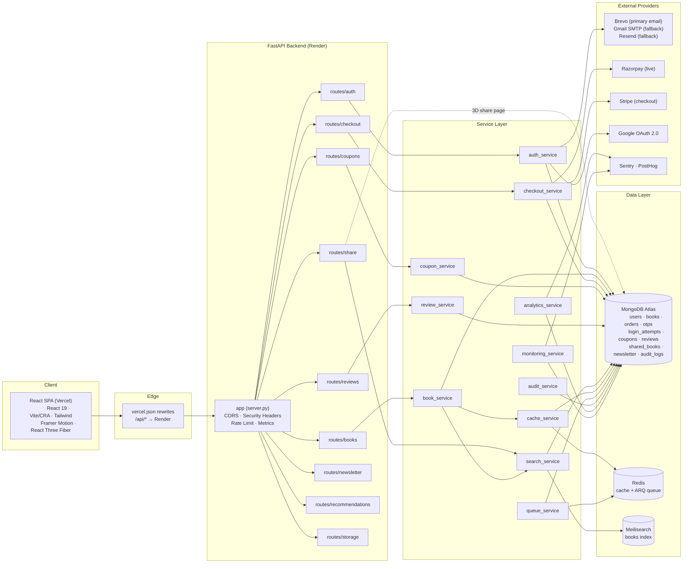
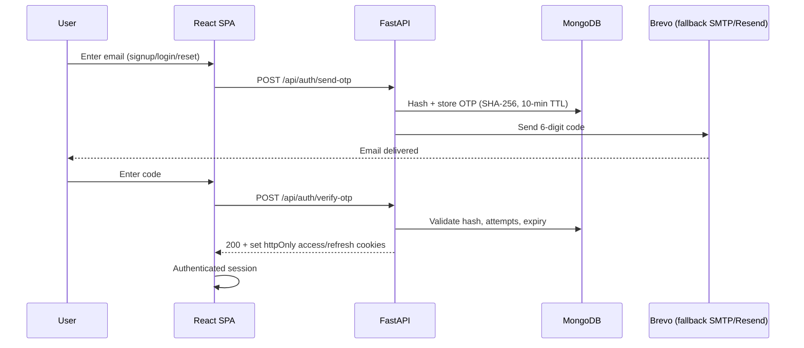
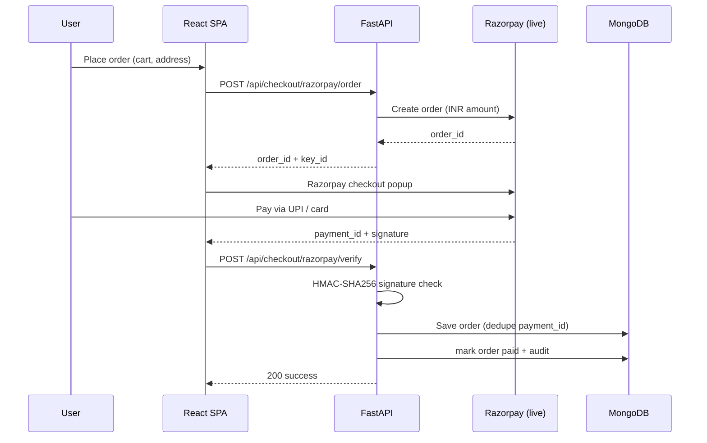
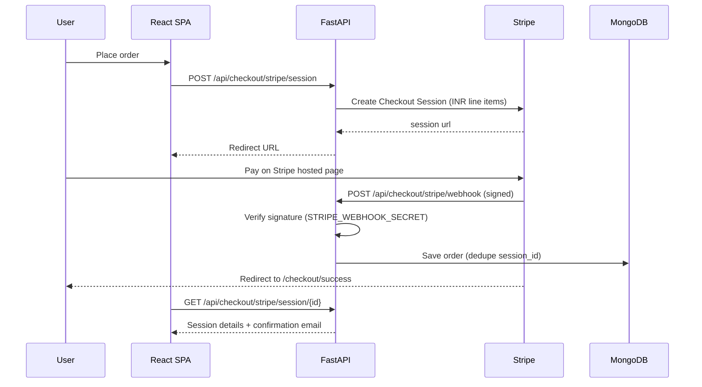

<p align="center">
  
</p>

<p align="center">
  <strong>Every Story Begins Here.</strong>
</p>

<p align="center">
  <a href="https://saga-drop-gules.vercel.app">Live Demo</a> ·
  <a href="https://sagadrop-backend.onrender.com/api/health">API Health</a> ·
  <a href="https://github.com/luccy93/SagaDrop">GitHub</a>
</p>

<p align="center">
  
  
  
  
  
  
  
  
</p>

---

## Overview

SagaDrop is a full-stack premium story book marketplace. A cinematic React storefront with a 3D hero experience sits on top of a FastAPI backend with JWT-authenticated checkout, OTP email verification, mood-based recommendations, a bespoke book customizer with shareable Open Graph pages, admin analytics, and production-grade observability.

It is fully deployed: the **React frontend runs on Vercel**, the **FastAPI backend runs on Render (free tier)**, backed by **MongoDB Atlas**, **Redis**, and optional **Meilisearch** — with graceful degradation so the store stays up even if an optional service is unavailable.

---

## Live URLs

| Service   | URL                                              |
|-----------|--------------------------------------------------|
| Frontend  | https://saga-drop-gules.vercel.app               |
| Backend   | https://sagadrop-backend.onrender.com            |
| Health    | https://sagadrop-backend.onrender.com/api/health |
| API Docs  | `https://sagadrop-backend.onrender.com/docs`     |

---

## Features

- **Cinematic storefront** — 3D hero (`@react-three/fiber` + `drei`), smooth scroll (Lenis), animated marquees, dark editorial design system.
- **Full catalog** — 40+ curated titles seeded at startup with prices in INR, ratings, badges (Best Seller / Trending / Award Winner) and curated collections (Editor's Picks, Award Winners, Collector Editions, New Releases).
- **Search & browse** — instant search powered by **Meilisearch** when available (in-memory fallback), plus category, collection, price-range, and sorting filters.
- **Mood-based Book Advisor** — `/api/recommend` returns hand-picked, mood-matched titles with reasons.
- **Bespoke Book Customizer** — configure material, foil, size, paper, finish and edge stain; generate a shareable cover with server-rendered Open Graph/Twitter card page and view tracking.
- **Authentication** — email **OTP** signup/login/password-reset (SHA-256 hashed codes, 10-min expiry, 5 attempts, 60 s resend cooldown) and **Google OAuth** (audience-validated). JWT access (15 min) + refresh (7 day) tokens in `httpOnly` cookies.
- **Checkout** — **Razorpay** (live — UPI & Indian cards) verified via HMAC signature on the server, and **Stripe Checkout** (cards) with signature-verified webhooks. Duplicate-payment protection.
- **Order management** — per-customer order history and an admin order pipeline (paid → processing → shipped → delivered / cancelled).
- **Coupons** — admin-created percentage coupons with usage caps and expiry; validated server-side.
- **Reviews & ratings** — authenticated users rate books once per book; aggregate rating stats per title.
- **Newsletter** — idempotent email capture.
- **Account sync** — cart & wishlist persist to the user's account (debounced) and restore on login.
- **Admin panel** — dashboard, books CRUD, orders, coupons, customers, analytics; every admin action written to an **audit log**.
- **Observability** — Prometheus metrics (`/api/metrics`), Sentry error tracking, PostHog analytics, structured audit logs, health endpoint.

---

## System Architecture



---

## Application Flows

### Email OTP signup / login



### Checkout — Razorpay



### Checkout — Stripe



---

## Tech Stack

### Frontend

| Layer      | Technology                                              |
|------------|----------------------------------------------------------|
| Framework  | React 19 · React DOM 19                                  |
| Build      | CRA + Craco · Vite · react-scripts 5                     |
| Styling    | Tailwind CSS 3.4 · tailwindcss-animate · tailwind-merge · clsx |
| UI        | Radix UI primitives (46+ `ui/` components) · lucide-react · embla-carousel · vaul · cmdk · sonner |
| 3D        | @react-three/fiber · @react-three/drei · three.js        |
| Animation | framer-motion · lenis (smooth scroll)                    |
| Data      | @tanstack/react-query · axios · swr                      |
| Forms     | react-hook-form · zod · @hookform/resolvers              |
| Auth      | @react-oauth/google (Google Identity Services)           |
| Charts    | recharts                                                |
| Tests     | Jest · @testing-library/react · @playwright/test (e2e)   |

### Backend

| Layer      | Technology                                              |
|------------|----------------------------------------------------------|
| Framework  | FastAPI 0.110 · Uvicorn · Pydantic 2                     |
| Database   | Motor (async MongoDB) · pymongo                          |
| Cache      | redis (async) with in-memory fallback                    |
| Queue      | ARQ (async Redis jobs) with in-process fallback          |
| Search     | Meilisearch client with in-memory fallback               |
| Auth       | pyjwt · bcrypt · python-jose · requests-oauthlib         |
| Payments   | razorpay SDK · stripe SDK                                |
| Email      | Brevo API (REST) · smtplib (Gmail) · resend SDK          |
| Analytics  | posthog · prometheus-client · sentry-sdk                 |
| Testing    | pytest · pytest-xdist · pytest-asyncio · black · flake8 · mypy |

### Infrastructure

| Component     | Technology                                   |
|---------------|----------------------------------------------|
| Frontend host | Vercel (rewrites `/api/*` → backend)         |
| Backend host  | Render (free tier, `render.yaml`)            |
| Database      | MongoDB Atlas (`MONGO_URL`)                  |
| Cache/Queue   | Redis (`REDIS_URL`)                          |
| Search        | Meilisearch (optional, `MEILI_URL`)          |
| Containers    | Docker Compose — Mongo, Redis, Meilisearch, backend, frontend, nginx, Prometheus, Loki, Grafana |
| Monitoring    | Prometheus (`/api/metrics`) · Grafana · Loki · Sentry · PostHog |
| Uptime        | UptimeRobot keep-alive ping on `/api/health` |

---

## Architecture Decisions

1. **Brevo over SMTP on Render.** Render's free tier blocks outbound SMTP (ports 587/465). Email is sent over HTTPS via the **Brevo API** (300 free emails/day), falling back to Gmail SMTP, then Resend.
2. **Client-verified Razorpay.** Razorpay signatures are verified server-side via HMAC-SHA256 (`order_id|payment_id`), so a webhook is intentionally **not** required.
3. **Graceful degradation.** Redis, Meilisearch, ARQ, Sentry, PostHog, and even MongoDB all fall back or fail soft, so catalog browsing stays available even when an optional service is down.
4. **Resilient async.** The cache, queue, and search services each have an in-process fallback so the app runs in a single process when Redis/Meilisearch are not configured.
5. **Two-layer caching.** Book catalog results are cached in Redis (5-min TTL) with deterministic `books:*` keys invalidated on any admin write; Meilisearch handles free-text search.

---

## Project Structure

```text
SagaDrop/
├── backend/
│   ├── server.py                 # FastAPI app, middleware, startup (indexes/seed/admin)
│   ├── config.py                 # env-driven config + CORS origins
│   ├── database.py               # Motor (MongoDB) client
│   ├── models.py                 # Pydantic models
│   ├── auth_utils.py             # JWT, bcrypt, cookies, current-user guard
│   ├── catalog.py                # seeded book catalog (40+ titles)
│   ├── middleware/
│   │   └── security.py           # OWASP headers + rate limiting (200 req/60 s)
│   ├── routes/                   # auth, books, checkout, coupons, reviews, share, newsletter, recommendations, storage
│   ├── services/                 # auth, book, checkout, coupon, review, search, cache, queue, audit, analytics, monitoring, storage
│   ├── tests/                    # pytest suite
│   ├── scripts/seed_db.py
│   ├── requirements.txt
│   ├── Dockerfile · Procfile · pytest.ini
│   └── .env.example
├── frontend/
│   ├── src/
│   │   ├── App.js                # all routes (auth, shop, discover, support, company, admin)
│   │   ├── lib/api.js            # typed axios client
│   │   ├── context/              # AuthContext · StoreContext (cart/wishlist)
│   │   ├── components/           # Navbar, Footer, Hero3D, CartDrawer, WishlistDrawer, BookCard, ShareModal, …
│   │   ├── components/ui/        # 46+ Radix/Tailwind primitives
│   │   ├── pages/                # home, product, search, auth, account, dashboard, orders, checkout, share
│   │   │   ├── shop/             # Trending · NewReleases · Bestsellers · CollectorEditions · GiftCards · Collections
│   │   │   ├── discover/         # Categories · BookAdvisor · BookCustomizer · Authors · Reviews
│   │   │   ├── support/          # TrackOrder · Shipping · Returns · FAQ · Contact
│   │   │   ├── company/          # About · Careers · Press · Sustainability · Terms
│   │   │   └── admin/            # Dashboard · Books · Orders · Coupons · Customers · Analytics
│   │   └── ...
│   ├── package.json
│   └── vercel.json               # CRA build + /api rewrite to Render
├── docker-compose.yml            # full local stack incl. observability
├── render.yaml                   # Render blueprint for the backend
├── nginx.conf · prometheus.yml · trivy.yaml
└── README.md
```

---

## Environment Variables

All secrets live only in deployment environments (Render / Vercel). **Never commit keys.** The backend reads them via `os.environ` (see `backend/config.py`).

| Variable              | Required | Description                                        |
|-----------------------|----------|----------------------------------------------------|
| `MONGO_URL`           | Yes      | MongoDB Atlas connection string                    |
| `DB_NAME`             | Yes      | Database name (e.g. `sagadrop`)                    |
| `JWT_SECRET`          | Yes      | Long random string used to sign access/refresh JWTs|
| `CORS_ORIGINS`        | Yes      | Comma-separated allowed origins                    |
| `ADMIN_EMAIL`         | No       | Admin account auto-created at startup              |
| `ADMIN_PASSWORD`      | No       | Admin password (hashed with bcrypt)                |
| `GOOGLE_CLIENT_ID`    | No       | Google OAuth client ID (published to production)   |
| `BREVO_API_KEY`       | No       | Brevo REST API key (primary email sender)          |
| `BREVO_FROM`          | No       | Verified sender email                              |
| `BREVO_FROM_NAME`     | No       | Sender display name                                |
| `SMTP_HOST`           | No       | Gmail SMTP fallback host                           |
| `SMTP_PORT`           | No       | 465 (implicit TLS)                                 |
| `SMTP_USER`           | No       | Gmail address                                      |
| `SMTP_PASS`           | No       | Gmail App Password                                 |
| `RESEND_API_KEY`      | No       | Resend fallback API key                            |
| `RESEND_FROM`         | No       | Resend sender address                              |
| `RAZORPAY_KEY_ID`     | No       | Razorpay key ID (live)                             |
| `RAZORPAY_KEY_SECRET` | No       | Razorpay key secret (live)                         |
| `STRIPE_SECRET_KEY`   | No       | Stripe secret key                                  |
| `STRIPE_WEBHOOK_SECRET`| No      | Stripe webhook signing secret                      |
| `REDIS_URL`           | No       | Redis URL for cache/queue (in-memory fallback)     |
| `MEILI_URL`           | No       | Meilisearch URL (fallback search)                  |
| `MEILI_MASTER_KEY`    | No       | Meilisearch master key                             |
| `SENTRY_DSN`          | No       | Sentry error tracking                              |
| `SENTRY_ENVIRONMENT`  | No       | e.g. `production`                                  |
| `POSTHOG_API_KEY`     | No       | PostHog product analytics                          |

> ⚠️ If a key is ever exposed, regenerate it immediately. GitHub push protection is enabled on this repository.

---

## Local Development

### Option A — Backend + frontend directly

**Backend** (needs MongoDB — use Docker below or Atlas):

```bash
cd backend
python -m venv .venv && .venv\Scripts\activate   # Windows
pip install -r requirements.txt
copy .env.example .env                           # fill MONGO_URL, JWT_SECRET, …
uvicorn server:app --reload --port 8000
```

**Frontend:**

```bash
cd frontend
npm install
npm run dev     # http://localhost:3000  (proxies /api to the backend)
```

### Option B — Full stack with Docker Compose

Starts MongoDB, Redis, Meilisearch, backend, frontend, nginx, Prometheus, Loki and Grafana:

```bash
docker compose up --build
```

- Frontend: http://localhost:5001
- Backend API: http://localhost:8001/api
- Prometheus: http://localhost:9090 · Grafana: http://localhost:3000 · Loki: http://localhost:3100

---

## Deployment

### Backend — Render (`render.yaml`)

```bash
render blueprint from render.yaml
# build:  pip install -r backend/requirements.txt
# start:  cd backend && uvicorn server:app --host 0.0.0.0 --port $PORT
```

Set `MONGO_URL`, `JWT_SECRET`, `CORS_ORIGINS`, `ADMIN_EMAIL`, `ADMIN_PASSWORD`, `GOOGLE_CLIENT_ID`, `BREVO_API_KEY`, `RAZORPAY_KEY_ID`, `RAZORPAY_KEY_SECRET`, `STRIPE_SECRET_KEY` (and optional keys) in **Environment** (masked, `sync: false`).

### Frontend — Vercel (`vercel.json`)

```bash
vercel --prod
```

`vercel.json` builds with CRA and rewrites `/api/*` → `https://sagadrop-backend.onrender.com/api/*`, with a SPA fallback to `index.html`.

### Cold-start keep-alive

Render free instances sleep after ~15 min idle. An UptimeRobot monitor pings `https://sagadrop-backend.onrender.com/api/health` every 5 minutes to keep the instance warm.

---

## Testing

```bash
# Backend (pytest + xdist, async tests included)
cd backend && pytest

# Frontend (Jest + Testing Library)
cd frontend && npm test

# Frontend E2E (Playwright)
cd frontend && npm run test:e2e
```

The backend suite (`backend/tests/`) covers the book service (list, filter, search, trending, CRUD), auth & share flows, and service-layer behavior without requiring a database.

---

## Security

- **Passwords** hashed with **bcrypt**; never stored in plain text.
- **JWTs** — 15-minute access token + 7-day refresh token, stored in `httpOnly`, `SameSite=Lax` cookies (`Secure` in production). Token type is validated on every request.
- **OTP** codes stored **SHA-256 hashed** with 10-minute expiry, max 5 attempts, 60 s resend cooldown, and account lockout after 5 failed logins (15 min, keyed by IP + email).
- **Google OAuth** — server-side audience (`azp`/`aud`) validation against the configured client ID.
- **Razorpay** — HMAC-SHA256 signature verification + duplicate-payment rejection (`payment_id` unique).
- **Stripe** — webhook signature verified with the webhook secret; session retrieval confirms `paid` status before fulfillment.
- **Rate limiting** — 200 requests / 60 s per client on `/api/*` (429 otherwise).
- **Headers** — `X-Content-Type-Options: nosniff`, `X-Frame-Options: DENY`, HSTS, `Referrer-Policy`, restrictive `Permissions-Policy`.
- **CORS** — restricted to configured origins with credentials.
- **Admin** — admin-only CRUD enforced via role checks; every mutation written to the `audit_logs` collection.
- **File uploads** — 5 MB cap, allow-listed image extensions, random filenames.

---

## Production Notes

- Email delivery uses **Brevo** (HTTPS) because Render's free tier blocks outbound SMTP; Gmail SMTP and Resend remain as fallbacks.
- Razorpay verification is **client-side** (`POST /api/checkout/razorpay/verify`); a Razorpay webhook is not required and won't parse at that endpoint.
- Stripe test cards: `4242 4242 4242 4242` (any future expiry / any CVV). Razorpay UPI test: `success@razorpay`.
- Books, order statuses, coupons and users are manageable from `/admin` once logged in as the admin account.
- Prometheus metrics are exposed at `/api/metrics` for scraping by Prometheus/Grafana.

---

## Roadmap

- [ ] Stripe live mode (currently test keys)
- [ ] Razorpay server-side webhook for server-confirmed order fulfillment
- [ ] Email order-invoice receipts with line-item totals (templated confirmation email already implemented)
- [ ] Pagination and infinite scroll on catalog/search pages
- [ ] Wishlist sharing and public reading lists
- [ ] Multi-language / i18n support
- [ ] iOS/Android PWA install support
- [ ] Cloud object storage (S3) for uploaded covers
- [ ] CI/CD pipeline with GitHub Actions (lint, typecheck, test, scan)

---

## Acknowledgements

- Book covers served from the Open Library Covers API.
- Design system assembled from Radix UI primitives and Tailwind CSS.
- Deployed free-tier-first: Vercel, Render, MongoDB Atlas, UptimeRobot.

---

<p align="center">
  <strong>Author:</strong> Devendra Prasad Kumar ·
  <a href="https://github.com/luccy93">github.com/luccy93</a>
</p>
<p align="center">© 2026 SagaDrop · Every Story Begins Here.</p>
